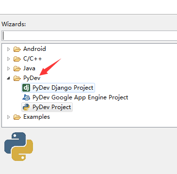

# 3. 相关安装

### 1. IDE

**eclipse**

如果你用习惯了ecilpse，可以直接装pydev插件，搭建python环境。

详细说明：

启用Eclipse————如果前面的步骤都正确无误的话，那么Eclipse就该能够正常启动了。 
第一次启动会让你选择一个工作空间，按缺省设置，勾选一下不再提醒，就可以了。

在Help菜单中，选择Install New Software···， 
选择Add按钮，Name：PyDev（这个随便起），Location：https://dl.bintray.com/fabioz/pydev/5.3.1（PyDev的更新地址）。然后就select，next，finish，立即重启就成功了。

新建project，你就会看到pydev。

因为已被和谐，所以可能安装不成功，我们换种方法，前往官网下载pydev，解压到eclipse目录，覆盖features与plugins文件夹。

重启eclipse，就成功了。

**sublime text**

因为早就想玩玩强大的sublime text，又不习惯eclipse分隔，所以尝试搭建一下。

打开sublimeText 
在菜单栏找到Tools——>编译系统——>新编译系统。

在新的配置文件中输入如下配置
{
"cmd": ["@","-u","$file"],
"file_regex": "^[ ]*File \"(...*?)\", line ([0-9]*)",
"selector": "source.python",
"encoding": "cp936",
}
其中@处填写你的电脑中python的安装路径。

Ctrl+S保存到SublimeText——>Data——>Packages——>User下
文件名保存为Python.sublime-build即可。

接下来可以测试一下输入print（1）；  
然后Ctrl+B编译
如果下方输出栏 输出了1 则说明成功。

如果没有输出，出现一栏不知名提示，很有可能是没有保存为.py文件。

### 2. 数据库

我使用的是Mysql，安装比较简单，不细说了，网上很多。

