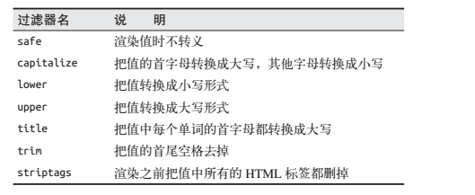

# 2. 模板

Flask使用的模板引擎是Jinja2，默认情况Flask在templates里查找对应模板文件，
例：
```
from flask import Flask, render_template
app = Flask(__name__)

@app.route('/')
def index():
	return render_template('index.html')

@app.route('/user/<name>')
def user(name):
	return render_template('user.html', name=name)

if __name__ == '__main__':
	app.run(debug=True)
```
保存为demo.py

运行demo.py，打开浏览器，你就可以看到对应的模板文件内容。

Jinja2能识别所有类型的变量，列表、字典、对象都可以识别。
例：
```
<p>dict: {{dict['key']}}</p>
<p>list: {{list[2]}}</p>
<p>method: {{obj.somemethod}}</p>
```
此外，还可以使用过滤器，用法：
> hello,{{name|upper}}



简单语法：
```
if判断

    hello, {{user}}

    hello, stranger!


for循环
<ul>
    
        <li> {{article}}</li>
    
</ul>

宏

	<li>{article}</li>


<ul>
	
	    {{ render_article(article) }}
	
</ul>


引入其他文件

```

Jiaja2还有模板继承的功能，如果你之前学过PHP的twig模板引擎，就会发现异曲同工。

你可以先定义一个基础模板base
```
<html>
<head>

<title></title>
<meta charset="utf-8" />

</head>
<body>


</body>
</html>
```

index可以这样写
```

index

	{{ super() }}


hello, python!

```
是不是超方便。super()是继承基础模板部分，因为基础模板head部分不是空的。